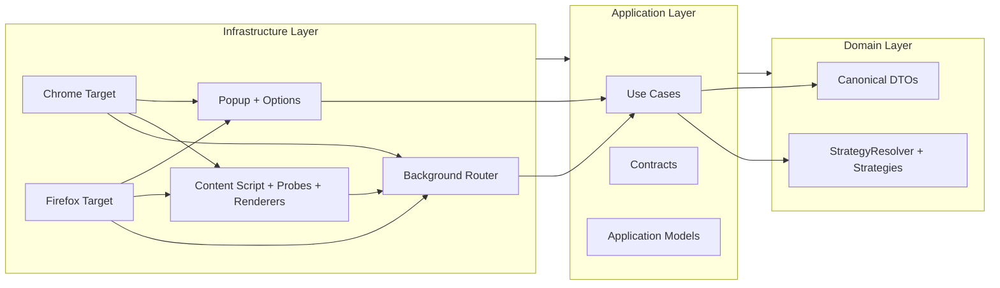
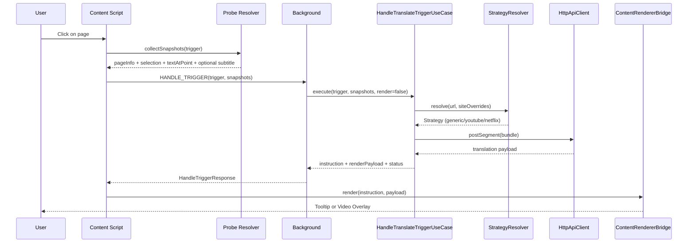

# Click-to-Translate Extension Architecture

## Source basis
This document is based on the requested planning files and implementation code:
- `browser-extension/step1.md` to `browser-extension/step8.md`
- Domain: `browser-extension/domain/src/*`
- Application: `browser-extension/application/src/*`
- Infrastructure: `browser-extension/infrastructure/chrome/src/*` and `browser-extension/infrastructure/firefox/src/*`

Note: `browser-extension/step4.md` is currently identical to `browser-extension/step3.md`.

## 1) Layer separation



## 2) How imports work

```mermaid
flowchart LR
  TS[TypeScript Source] --> ALIAS[@domain / @application imports]
  ALIAS --> TSCONFIG[tsconfig.base.json paths]
  TSCONFIG --> ESBUILD[scripts/build-extension.mjs ts-path-alias plugin]
  ESBUILD --> DISTCH[dist/chrome bundles]
  ESBUILD --> DISTFF[dist/firefox bundles]
```

Import rules implemented in code:
- `@domain` resolves to `browser-extension/domain/src/index.ts`.
- `@application` resolves to `browser-extension/application/src/index.ts`.
- Domain does not import application or infrastructure.
- Application imports domain types and strategies, but not infrastructure.
- Infrastructure imports both domain and application contracts/use-cases and binds concrete implementations.

Build/package:
- Entry points are browser-specific infrastructure files: background, content script, options page, popup page.
- `scripts/build-extension.mjs` bundles each entry point with esbuild and copies manifests/static assets to `dist/chrome` and `dist/firefox`.

## 3) Runtime flow (click-to-translate)



## 4) Class responsibilities

### Domain classes
| Class | File | Responsibility |
|---|---|---|
| `StrategyResolver` | `browser-extension/domain/src/strategies/StrategyResolver.ts` | Chooses strategy by URL and optional override patterns, with fallback to generic. |
| `GenericStrategy` | `browser-extension/domain/src/strategies/generic/GenericStrategy.ts` | Generic capture/display logic: word from selection/text-at-point, sentence from local context, tooltip display. |
| `YouTubeStrategy` | `browser-extension/domain/src/strategies/youtube/YouTubeStrategy.ts` | YouTube-specific capture: subtitle sentence when available, source `YOUTUBE`, video overlay display. |
| `NetflixStrategy` | `browser-extension/domain/src/strategies/netflix/NetflixStrategy.ts` | Netflix-specific capture with subtitle-first behavior and generic fallback; video overlay when subtitle exists. |

### Application classes
| Class | File | Responsibility |
|---|---|---|
| `EnsureAuthSessionUseCase` | `browser-extension/application/src/usecases/EnsureAuthSessionUseCase.ts` | Resolves usable auth session by reuse, refresh-token flow, or optional interactive login. |
| `GetSelectableLanguagesUseCase` | `browser-extension/application/src/usecases/GetSelectableLanguagesUseCase.ts` | Loads languages from API and maps selected source/target languages from settings. |
| `GetSettingsUseCase` | `browser-extension/application/src/usecases/GetSettingsUseCase.ts` | Reads effective settings from `SettingsStore`. |
| `HandleTranslateTriggerUseCase` | `browser-extension/application/src/usecases/HandleTranslateTriggerUseCase.ts` | Main orchestration: hotkey check, snapshot capture/use provided snapshots, strategy execution, bundle creation, API post, and render instruction payload creation. |
| `LoginUseCase` | `browser-extension/application/src/usecases/LoginUseCase.ts` | Starts interactive auth by delegating to `EnsureAuthSessionUseCase`. |
| `LogoutUseCase` | `browser-extension/application/src/usecases/LogoutUseCase.ts` | Clears local session and optionally calls remote logout/revoke via `AuthFlow`. |
| `SaveSettingsUseCase` | `browser-extension/application/src/usecases/SaveSettingsUseCase.ts` | Persists settings and returns normalized stored result. |

### Infrastructure classes (Chrome and Firefox variants)
| Class | File(s) | Responsibility |
|---|---|---|
| `ContentRendererBridge` | `browser-extension/infrastructure/chrome/src/content/render/rendererBridge.ts`, `browser-extension/infrastructure/firefox/src/content/render/rendererBridge.ts` | Implements application `Renderer` in content context; routes mode to tooltip/overlay/no-op. |
| `TooltipRenderer` | `browser-extension/infrastructure/chrome/src/content/render/tooltipRenderer.ts`, `browser-extension/infrastructure/firefox/src/content/render/tooltipRenderer.ts` | Shadow-DOM tooltip UI with positioning and dismiss listeners. |
| `VideoOverlayRenderer` | `browser-extension/infrastructure/chrome/src/content/render/videoOverlayRenderer.ts`, `browser-extension/infrastructure/firefox/src/content/render/videoOverlayRenderer.ts` | Overlay renderer for video sites, rect/point anchor positioning and dismiss logic. |
| `ApiHttpError` | `browser-extension/infrastructure/chrome/src/impl/apiClient.ts`, `browser-extension/infrastructure/firefox/src/impl/apiClient.ts` | Typed HTTP error carrying status/code from backend responses. |
| `HttpApiClient` | `browser-extension/infrastructure/chrome/src/impl/apiClient.ts`, `browser-extension/infrastructure/firefox/src/impl/apiClient.ts` | Concrete API adapter: languages fetch, segment post, refresh token. |
| `SystemClock` | `browser-extension/infrastructure/chrome/src/impl/clock.ts`, `browser-extension/infrastructure/firefox/src/impl/clock.ts` | `Clock` implementation using `Date.now()`. |
| `ChromeSettingsStore` | `browser-extension/infrastructure/chrome/src/impl/settingsStore.ts` | Settings persistence through `chrome.storage.local` with normalization/default merge. |
| `FirefoxSettingsStore` | `browser-extension/infrastructure/firefox/src/impl/settingsStore.ts` | Settings persistence through `browser.storage.local` with normalization/default merge. |
| `ChromeAuthSessionStore` | `browser-extension/infrastructure/chrome/src/impl/authSessionStore.ts` | Auth session persistence/validation in Chrome storage. |
| `FirefoxAuthSessionStore` | `browser-extension/infrastructure/firefox/src/impl/authSessionStore.ts` | Auth session persistence/validation in Firefox storage. |
| `ChromeAuthFlow` | `browser-extension/infrastructure/chrome/src/impl/authFlow.ts` | OAuth2 Authorization Code + PKCE via `chrome.identity.launchWebAuthFlow`. |
| `FirefoxAuthFlow` | `browser-extension/infrastructure/firefox/src/impl/authFlow.ts` | OAuth2 Authorization Code + PKCE via `browser.identity` APIs. |

## 5) Key non-class modules that complete the architecture

- Message routers:
  - `browser-extension/infrastructure/chrome/src/background/background.ts`
  - `browser-extension/infrastructure/firefox/src/background/background.ts`
- Message DTO contracts:
  - `browser-extension/infrastructure/chrome/src/background/messageTypes.ts`
  - `browser-extension/infrastructure/firefox/src/background/messageTypes.ts`
- Probe pipeline:
  - `browser-extension/infrastructure/chrome/src/content/probes/probeResolver.ts`
  - `browser-extension/infrastructure/firefox/src/content/probes/probeResolver.ts`
  - plus generic/text-at-point/YouTube/Netflix probe modules in each target.
- Composition roots (DI wiring):
  - `browser-extension/infrastructure/chrome/src/compositionRoot.ts`
  - `browser-extension/infrastructure/firefox/src/compositionRoot.ts`

## 6) Browser split summary

Implementation is intentionally duplicated per browser target and differs mainly in platform API adapters:
- Different APIs for runtime messaging and storage (`chrome.*` vs `browser.*`).
- Different auth flow wrappers (`ChromeAuthFlow` vs `FirefoxAuthFlow`).
- Shared domain/application behavior and near-identical probe/renderer logic.
